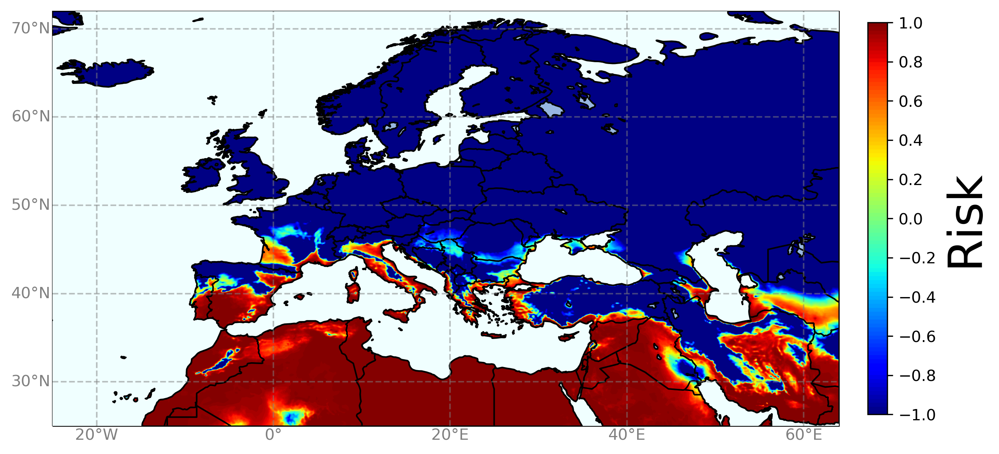

# Global-risk-predictions-for-Pierce-s-disease-of-grapevines
This repository contains the simulation code used to assess global risk of Pierce's Disease of grapevines, published in

Table of contents
=================

<!--ts-->
   * [Overview](#overview)
   * [Table of contents](#table-of-contents)
   * [Requeriments](#requeriments)
   * [Simulation steps](#simulation-steps)
   * [Example](#run-example)
   * [Further usage](#further-usage)
   * [Authors](#authors)
   * [License](#license)
<!--te-->

# Requeriments

### Julia 1.5 or higher installed with the following libraries
- [GRIB.jl](https://github.com/weech/GRIB.jl)
- [DataFrames.jl](https://dataframes.juliadata.org/stable/)
- [Feather.jl](https://github.com/JuliaData/Feather.jl)
- [Dates.jl](https://docs.julialang.org/en/v1/stdlib/Dates/)

### Python 3.x installed with the following libraries
- [Numpy](https://numpy.org/doc/stable/index.html)
- [Matplotlib](https://matplotlib.org/devdocs/index.html)
- [Cartopy](https://scitools.org.uk/cartopy/docs/latest/#)


# Simulation steps

Here we describe the simulation steps to assess PD risk. Although the steps are general, we describe them in relation with the example provided in this repository. For details on further usage see [Further usage](#further-usage)

* Download temperature data
  
  In our work, temperature data was downloaded from [ERA5-Land dataset](https://cds.climate.copernicus.eu/cdsapp#!/dataset/reanalysis-era5-land?tab=overview) in GRIB format. The necessary data files to run the example are included in this repository.

* Compute MGDD and CDD factors

  Once data has been downloaded, the next step is to compute the climatic variables of interest, i.e. MGDD and CDD anual factors. We provide a julia script 'compute_climatic_variables' that is prepared to work with the provided example. The script loads a self-made library described in [this repository](https://github.com/agimenezromero/ERA5-Land-data-analysis) and computes the climatic variables from the data included in the repository. 

* Run simulation
  
  In this example we provide the code to simulate one year of PD progression (as more years would involve upload more and more data).
  
  The code is as simple as this
  
  ```python
  #Define MGDD factor
  def prob_MGDD(x):

    return 1 / (1 + np.exp(-0.0120*(x-975)))
  
  #Definde CDD factor
  def prob_CDD(x):

      return 2e7/(2e7 + x**3)

  #This is the simulation algorithm for 1 time step only (just for testing purposes)
  def disease_simulation(filename_MGDD, filename_CDD, R0=5.0, γ=1.0/5.0, I0=1.0, use_vector=False, 
                         filename_vector="Data/vector_Europe.txt"):

      I = I0

      if use_vector == True:

          vector, lons_v, lats_v = np.loadtxt(filename_vector, unpack=True)

          R0_f = R0 * vector/1000

      else:

          R0_f = R0

      MGDD, lons, lats = np.loadtxt(filename_MGDD, unpack=True)
      CDD, lons, lats = np.loadtxt(filename_CDD, unpack=True)

      prob_1 = prob_MGDD(MGDD)
      prob_2 = prob_CDD(CDD)

      prob_f = prob_1 * prob_2

      I = I * prob_f * np.exp((R0_f-1)*γ)

      risk = np.log(I) / ((R0_f-1)*γ*1)

      risk[risk < -1.0] = -1.0

      return risk, lons, lats
  ```

* Plot risk
  
  To plot the risk maps we use [Cartopy](https://scitools.org.uk/cartopy/docs/latest/#) library.
  
  First, we need to reshape the risk values to a 2D array with its original shape, this is, the shape of the downloaded climatic data. In our self-developed library that computes the climatic variables, (see [this repository](https://github.com/agimenezromero/ERA5-Land-data-analysis)) this shape is saved in the header of the climatic variables output files.
  
  ```python
  Europe_shape = (471, 891) 

  risk = np.reshape(risk, Europe_shape)
  lons = np.reshape(lons, Europe_shape)
  lats = np.reshape(lats, Europe_shape)
  ```
  
  Then, we are ready to plot
  
  ```python
  
    clevels = np.linspace(-1, 1, 100)
    cbar_ticks = np.arange(-1, 1.2, 0.2)

    cmap = 'jet'

    #-- create figure and axes instances
    fig = plt.figure(figsize=(11, 11), dpi=100)
    ax  = fig.add_axes([0.1,0.1,0.8,0.9])

    projection = ccrs.PlateCarree()

    #-- create map
    ax = plt.axes(projection=projection) 

    #-- add map features
    ax.coastlines(resolution='10m') #110m, 50m, 10m
    ax.add_feature(cartopy.feature.LAND, edgecolor='black')
    ax.add_feature(cartopy.feature.LAKES, edgecolor='black')
    ax.add_feature(cartopy.feature.BORDERS, edgecolor='black')
    ax.add_feature(cartopy.feature.OCEAN, zorder=100, edgecolor='black', facecolor='azure')

    cnplot = ax.contourf(lons, lats, risk, clevels, cmap=cmap)

    cbar = plt.colorbar(cnplot, ticks=cbar_ticks, shrink=0.42, pad = 0.03)

    gl = ax.gridlines(crs=projection, linewidth=1, color='gray', alpha=0.5, zorder=200, linestyle='--')

    gl.xlabel_style = {'size': 8, 'color': 'gray'}
    gl.ylabel_style = {'size': 8, 'color': 'gray'}

    gl.bottom_labels = True
    gl.left_labels = True
  ```
  
  

# Run example

- To compute the climatic variables just run the Julia script (compute_climatic_variables.jl) via command line as
  
  `julia compute_climatic_variables.jl` or in background as `nohup julia compute_climatic_variables.jl &`

- To run the simulation just use the jupyter notebook provided (simulation_test.ipynb)

  Some features can be customised:
  
  * R0 (float) - Basic Reproduction Number - Default: 5.0
  * γ (float) - Mortality rate of infected plants - Default: 0.2
  * I0 (float) - Initial number of infected plants - Default: 1.0
  * use_vector (Boolean) - Determines the use of the vector climatic suitability to account for a spatially dependent R0 - Default: False

# Further usage
  
  
